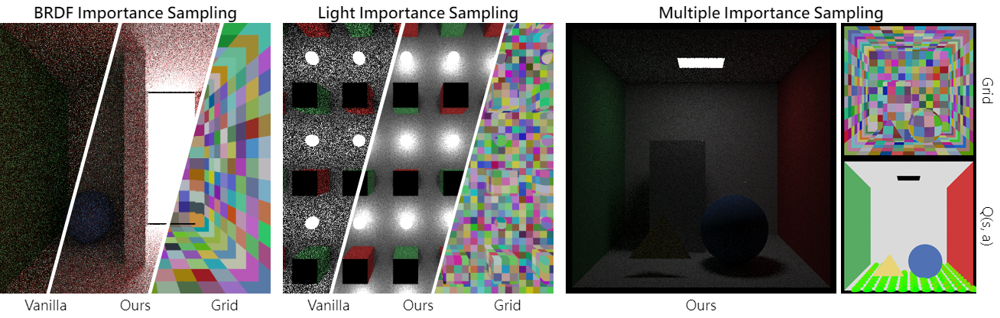

# Path Tracing with Q-Learning

### [[Project](https://alexkeroro86.github.io/PathGuideRL/)]

This is an implementation towards [Learning Light Transport the Reinforced Way, SIGGRAPH 2017 Talks](https://dl.acm.org/doi/10.1145/3084363.3085032).

Jen-I Pan

_Bachelor Thesis, National Tsing Hua University, 2019_



## Prerequisites

The device is a NVDIA GPU with CUDA installed on Windows:
* MSVC: > v141
* CUDA: > 10

## Reference & Resources

* [Ray Tracing from the Ground Up](https://www.amazon.com/Ray-Tracing-Ground-Kevin-Suffern/dp/1568812728)
* [Ray Tracing in One Weekend](https://raytracing.github.io/)
* [Accelerated Ray Tracing in One Weekend in CUDA](https://developer.nvidia.com/blog/accelerated-ray-tracing-cuda/)
* [CS 188 at UC Berkeley | Introduction to Artificial Intelligence](https://inst.eecs.berkeley.edu/~cs188/fa19/)
* [CS 285 at UC Berkeley | Deep Reinforcement Learning](https://rail.eecs.berkeley.edu/deeprlcourse/)
* Greger, Gene, et al. "The irradiance volume." IEEE Computer Graphics and Applications 18.2 (1998): 32-43.
* Vose, Michael D. "A linear algorithm for generating random numbers with a given distribution." IEEE Transactions on software engineering 17.9 (1991): 972-975.

## Citation

```
@misc{Pan2019,
    author = {Pan, Jen-I},
    title = {Path Tracing with Q-Learning},
    year = {2019}
}
```
